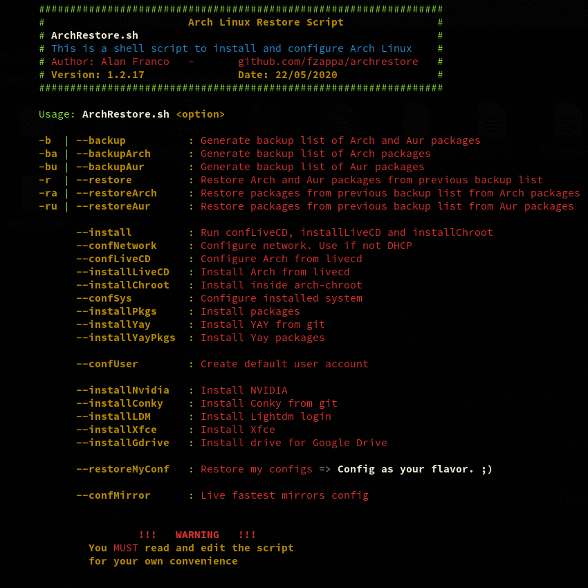

Arch Linux Restore Script (Shell Script)
============================================

Script to restore my basic Arch Linux config.
--------------------------------------------------------------------------
Steps to run:

0. Read the script and adapt to your needs
1. Copy the files ArchRestore.sh, completion.sh and folder functions to pen-drive
2. Boot Arch Linux (Live CD)
3. Mount pen-drive and copy those files to /install (e.g)
4. Run ./ArchRestore.sh from /install folder to see the options

Basic usage to install.

```sh
# ./ArchRestore.sh --confLiveCD
# ./ArchRestore.sh --installLiveCD
# arch-chroot /mnt
# source completion.sh #(For bash completion)
# ./ArchRestore.sh --installChroot
# reboot 
```

> **About:**
> 
>- Project made and tested on Arch Linux
>- GPL v3
>


